# 🌱 GreenThumb — Mobile App UI/UX Prototype & Design System
### *Final Project Prototype (Assignment 4)*

[-F24E1E?style=for-the-badge&logo=figma&logoColor=white)](./design/AppPrototype_UIUX_Sheikh_Assignment4.fig)
[](./design)
[](./design/AppPrototype_UIUX_Sheikh_Assignment4.fig)
[](./LICENSE)

**GreenThumb** is a human-centered digital gardening companion and urban grower ecosystem. This repository hosts the **Final Project Mobile App Prototype (Assignment 4)**, featuring a comprehensive design system, intuitive botanical care tracking, community garden integration, and interactive user flows.

---

## 📱 Final Project Showcase: Mobile App Prototype (Assignment 4)

The final milestone delivers a high-fidelity mobile user experience optimized for everyday plant care, real-time telemetry, and community gardening.

### Complete Mobile Prototype Architecture
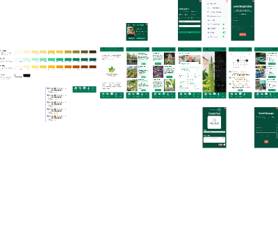

### Key Final Features & User Flows

| Feature Module | Visual Deliverable | UX Highlights |
| :--- | :---: | :--- |
| **Plant Care & Hydration Tracking** | 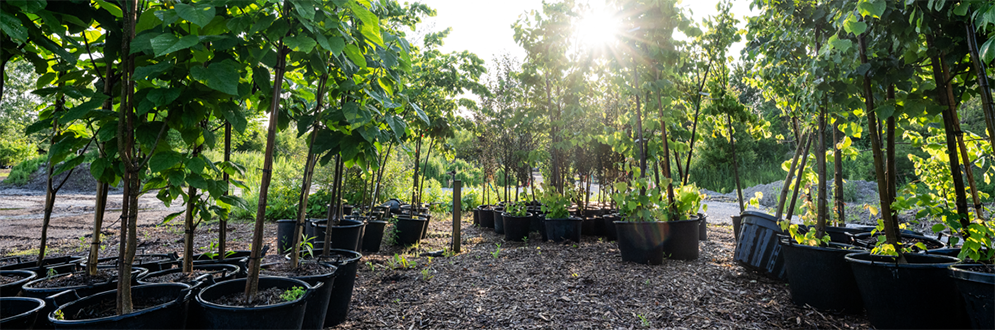 | Smart watering schedules, moisture gauges, sunlight exposure indicators, and EasyCare diagnostic cards. |
| **Botanical Discovery & Profiles** | 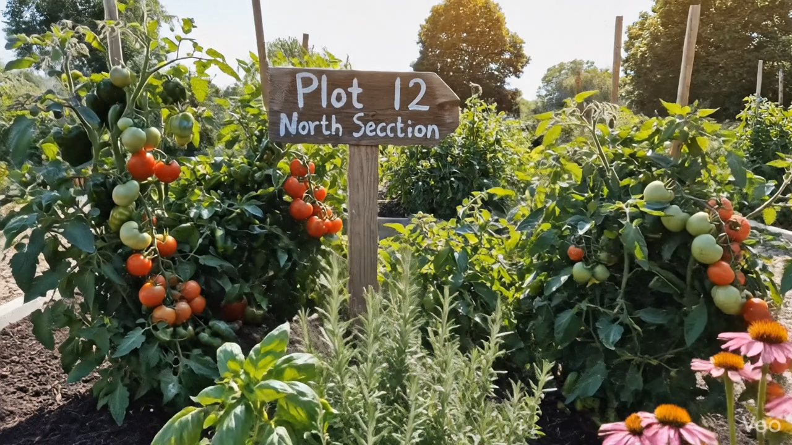 | High-resolution plant profiles with species specifications, soil prep guides, and community harvest logs. |
| **Interactive Navigation & UI Tokens** | *Embedded in Figma Prototype* | Persistent bottom navigation (Home, Catalog, Scanner, Community, Profile), accessible WCAG AAA green palette, and tactile card states. |
| **EasyCare Loyalty & Community Rewards** | *Embedded in Figma Prototype* | Gamified gardening milestones, QR loyalty cards, volunteer badges, and plot booking waitlists. |
| **Account & Profile Management** | *Embedded in Figma Prototype* | Custom notification preferences, dark/light theme options, and plot subscription settings. |

---

## 💻 Web Platform Prototype (Assignment 3)

The high-fidelity web companion connecting gardeners with local plot reservations, workshop calendars, and verified seed/supply vendors.

| Web Module | Screen Capture | Core Capabilities |
| :--- | :---: | :--- |
| **Landing & Discovery Hub** |  | Dynamic search, seasonal gardening spotlights, and quick-access categories. |
| **Community Gardens Directory** | 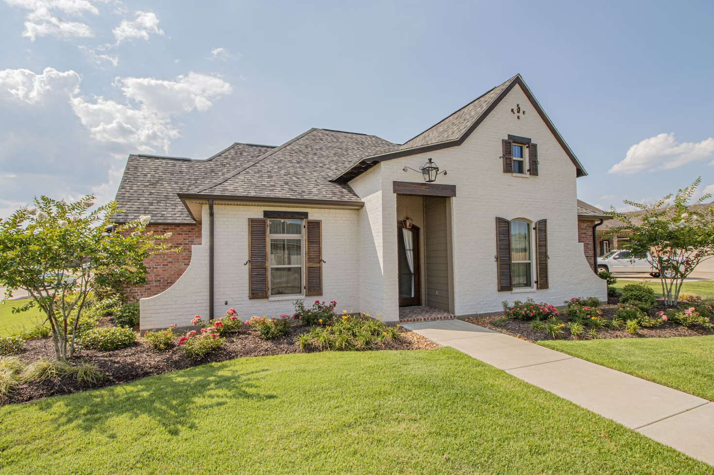 | Local garden locator, plot availability tracker, and volunteer team rosters. |
| **Plant Care Encyclopedia** | 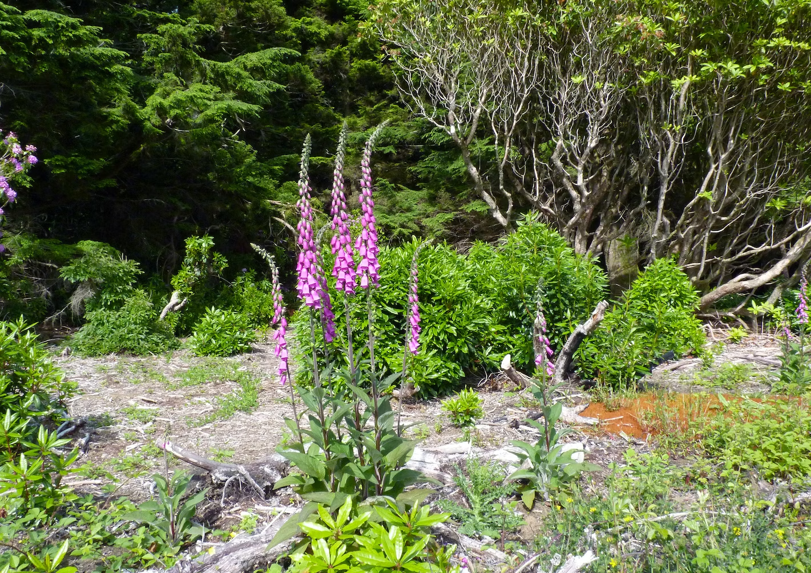 | Filterable botanical database by light requirement, indoor/outdoor suitability, and soil type. |
| **Marketplace & Local Nurseries** | 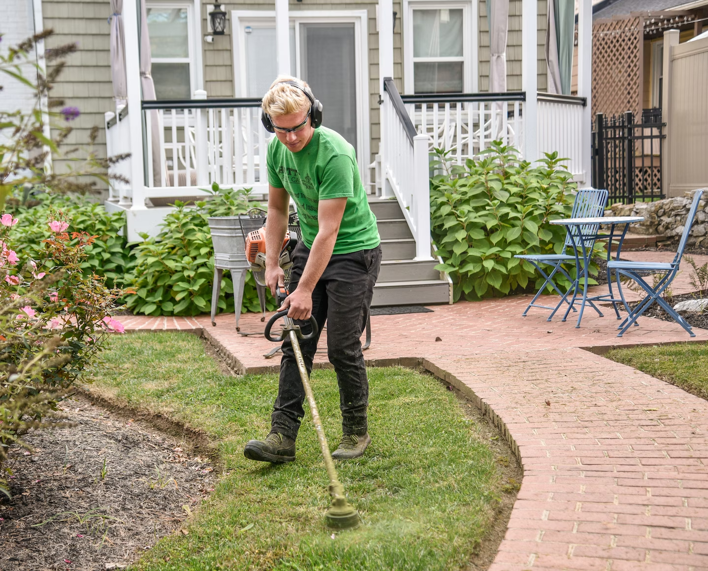 | Direct nursery marketplace for starter plants, organic soil, seed kits, and tools. |
| **Events & Workshop Calendar** |  | Community planting workdays, pruning masterclasses, and RSVP management. |

---

## 📐 Project Foundations: Low-Fi Wireframes (Assignment 1 & 2)

The design began with low-fidelity whiteboard ideation and information architecture mapping to establish user flows before advancing to high-fidelity prototyping.

### Low-Fidelity Whiteboard Ideation Board
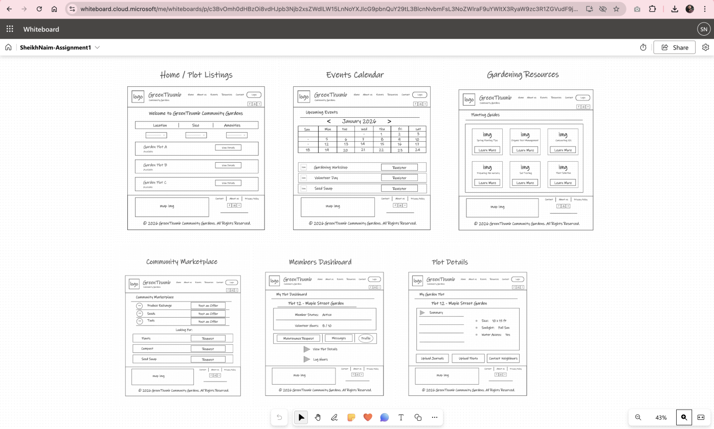

<details>
<summary><b>🔍 Expand Low-Fi Screen Breakdown (Click to view individual wireframes)</b></summary>
<br/>

| Wireframe Module | Screen | Focus |
| :--- | :---: | :--- |
| **Home / Plot Listings** | 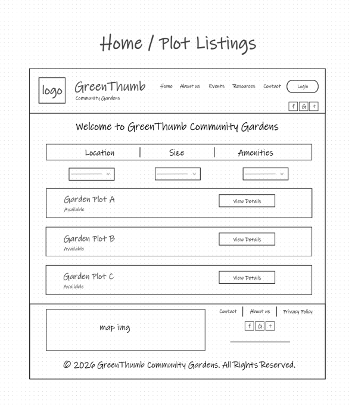 | Filter bar by location, size, amenities & availability list. |
| **Events Calendar** | 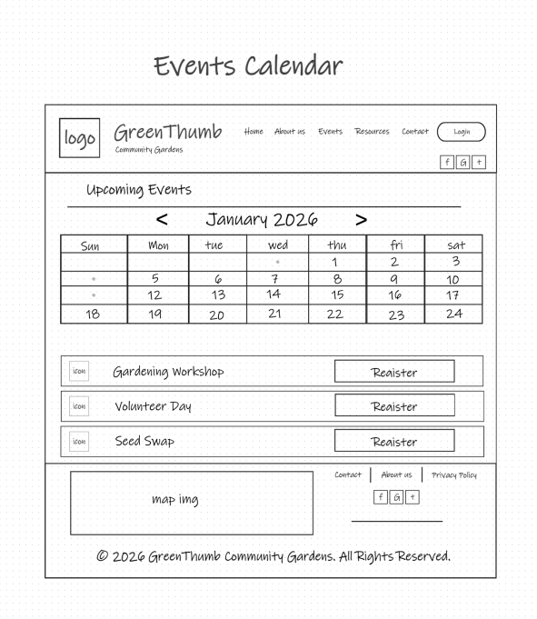 | Monthly workshop schedule & volunteer signup actions. |
| **Gardening Resources** | 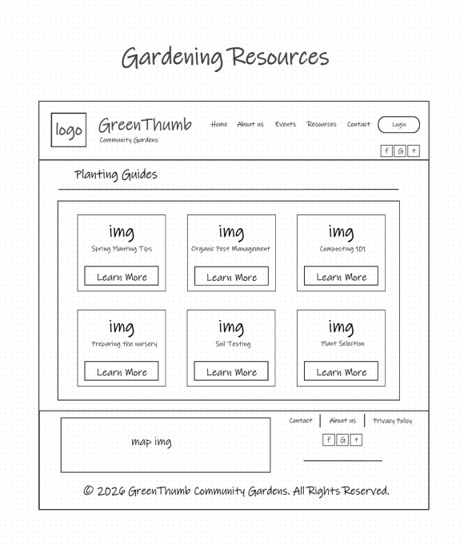 | Structured grid for planting guides, soil testing & composting. |
| **Community Marketplace** | 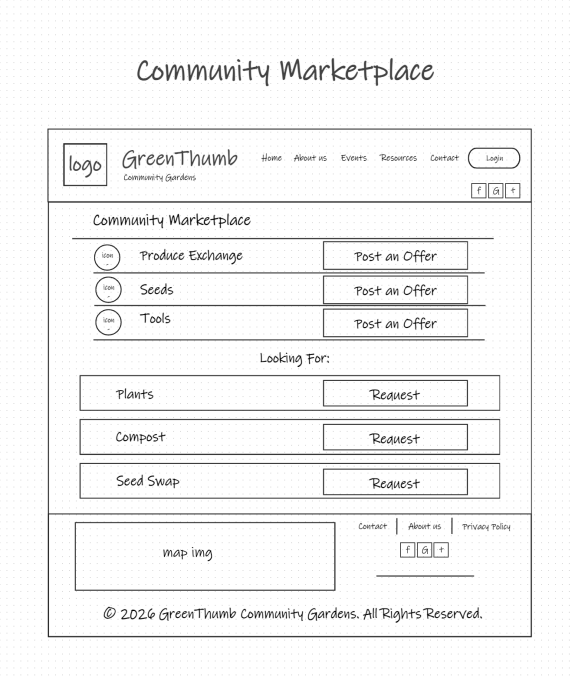 | Produce exchange, tool sharing & seed swap boards. |
| **Members Dashboard** | 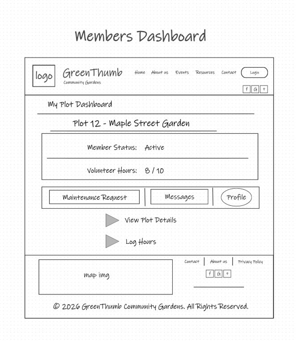 | Active plot status, volunteer hour logs & maintenance tickets. |
| **Plot Details** | 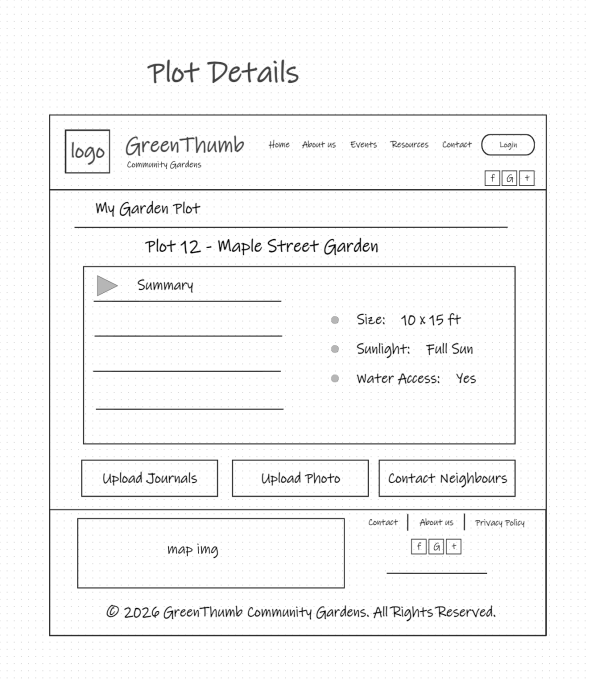 | Dimensions, sunlight/water access & photo upload journal. |

</details>

---

## 🔄 End-to-End Design Evolution

```
┌────────────────────────────┐      ┌────────────────────────────┐      ┌────────────────────────────┐      ┌────────────────────────────┐
│ Phase 1: UX Brief & Low-Fi │ ───► │ Phase 2: Wireframe Systems │ ───► │ Phase 3: Web Hi-Fi Proto   │ ───► │ Phase 4: Final Mobile App  │
│ (Assignment 1)             │      │ (Assignment 2)             │      │ (Assignment 3)             │      │ ★ (Assignment 4 - FINAL) ★ │
└────────────────────────────┘      └────────────────────────────┘      └────────────────────────────┘      └────────────────────────────┘
```

| Milestone | Deliverable File | Role in Project |
| :--- | :--- | :--- |
| **Phase 4 (Final)** | [**`design/AppPrototype_UIUX_Sheikh_Assignment4.fig`**](design/AppPrototype_UIUX_Sheikh_Assignment4.fig) | **★ Final Mobile App Interactive Prototype, Design System & UI Components ★** |
| **Phase 3** | [`design/Prototype_Assignment3_UIUX_SheikhNaim.fig`](design/Prototype_Assignment3_UIUX_SheikhNaim.fig) | High-Fidelity Web Prototype, Community Modules & Marketplace |
| **Phase 2** | [`design/SheikhNaim_UI_UX_Assignment2.fig`](design/SheikhNaim_UI_UX_Assignment2.fig) | Responsive Web Architecture & Wireframe Grid System |
| **Phase 1** | [`design/SheikhNaim-Assignment1.docx`](design/SheikhNaim-Assignment1.docx) | UX Research Brief, Problem Statements & Low-Fi Whiteboard Wireframes |

---

## 📂 Repository Structure

```
greenthumb-uiux-prototype/
├── design/
│   ├── AppPrototype_UIUX_Sheikh_Assignment4.fig          # ★ FINAL PROJECT: Mobile App Prototype & Design System
│   ├── Prototype_Assignment3_UIUX_SheikhNaim.fig         # Phase 3: High-Fidelity Web Prototype & Flows
│   ├── SheikhNaim_UI_UX_Assignment2.fig                  # Phase 2: Responsive Web Architecture
│   └── SheikhNaim-Assignment1.docx                       # Phase 1: User Research Brief & Low-Fi Wireframes
├── screenshots/
│   ├── mobile-app-prototype-overview.png                 # Final Mobile Prototype Board
│   ├── plant-care-banner.png                             # Final Plant Care Tracker Banner
│   ├── community-plot-banner.png                         # Final Community Plot Showcase Banner
│   ├── web-landing-hero.png                              # Web Prototype Landing Hero
│   ├── web-community-gardens.png                         # Web Community Garden Network
│   ├── web-plant-care-guide.png                          # Web Plant Care Guide
│   ├── web-marketplace-plants.png                        # Web Marketplace Catalog
│   ├── web-events-calendar.png                           # Web Events & Workshops Calendar
│   ├── web-prototype-overview.png                        # Web Prototype Board
│   ├── web-wireframes-overview.png                       # Wireframes Board
│   ├── lowfi-wireframes-whiteboard-overview.png          # Whiteboard Wireframes Board
│   ├── lowfi-home-plot-listings.png                      # Low-Fi Plot Listings
│   ├── lowfi-events-calendar.png                         # Low-Fi Events Calendar
│   ├── lowfi-gardening-resources.png                     # Low-Fi Resources
│   ├── lowfi-community-marketplace.png                   # Low-Fi Marketplace
│   ├── lowfi-members-dashboard.png                       # Low-Fi Dashboard
│   └── lowfi-plot-details.png                            # Low-Fi Plot Details
├── .gitignore
├── LICENSE
└── README.md
```

---

## 🚀 Running the Final Prototype in Figma

1. **Clone or download the repository:**
   ```bash
   git clone https://github.com/snaimio/greenthumb-uiux-prototype.git
   ```
2. **Open [Figma](https://www.figma.com/)** in your browser or desktop application.
3. **Import the Final Prototype:**
   - Drag and drop **[`design/AppPrototype_UIUX_Sheikh_Assignment4.fig`](./design/AppPrototype_UIUX_Sheikh_Assignment4.fig)** into your Figma workspace.
4. **Enter Prototype / Presentation Mode:**
   - Press `Cmd + Option + Enter` (macOS) or `Ctrl + Alt + Enter` (Windows) to run the interactive mobile user flows and transitions.

---

## 👤 Author & Designer

**Sheikh Naim (Tanjin Sufi)**  
- GitHub: [@snaimio](https://github.com/snaimio)  
- Figma: [GreenThumb Prototype on Figma](https://www.figma.com)
