<div align="center">

# 🌱 GreenThumb — Smart Urban Gardening Platform & Design System
### **Human-Centered Product Design Case Study • Mobile & Web Architecture • Interactive Prototype**

[](https://www.figma.com/proto/7nucLqgY1E8BgaqP8KAQKA/AppPrototype_UIUX_Sheikh_?node-id=7-1388&p=f&t=HIqKhgHtpnOWBKuI-1&scaling=scale-down&content-scaling=fixed&page-id=7%3A1439&starting-point-node-id=195%3A3757)
[](./design)
[](./screenshots)
[](./screenshots)
[](./LICENSE)

<br/>

**Designed & Architected by Sheikh Naim**  
*Lead UI/UX • Product Design • Design Systems • Interactive Prototyping*

[**🚀 Launch Interactive Figma Prototype**](https://www.figma.com/proto/7nucLqgY1E8BgaqP8KAQKA/AppPrototype_UIUX_Sheikh_?node-id=7-1388&p=f&t=HIqKhgHtpnOWBKuI-1&scaling=scale-down&content-scaling=fixed&page-id=7%3A1439&starting-point-node-id=195%3A3757) • [**📱 Mobile UI Showcase**](#-flagship-mobile-experience--core-screen-flows) • [**🎨 Design System Tokens**](#-design-system--visual-architecture) • [**📐 Design Lifecycle**](#-end-to-end-product-design-lifecycle)

</div>

---

## 📌 Executive Summary & Product Strategy

**GreenThumb** is an end-to-end digital gardening ecosystem designed to bridge the gap between novice urban plant enthusiasts, experienced horticulturists, and neighborhood community gardens.

Urban gardeners frequently encounter critical pain points: inconsistent hydration schedules, difficulty diagnosing environmental stressors, isolated gardening efforts, and zero visibility into local communal plot availability. GreenThumb resolves these challenges through a unified, accessible product architecture featuring **real-time IoT soil telemetry, localized garden plot allocation, community knowledge bases, and peer-to-peer marketplace exchange.**

```
┌────────────────────────────────────────────────────────────────────────────────────────┐
│                                 PRODUCT SPECIFICATIONS                                 │
├───────────────────┬────────────────────────────────────────────────────────────────────┤
│ 🎯 Role           │ Lead Product & UI/UX Designer (End-to-End Execution)               │
│ 🛠 Methodology     │ Double Diamond: Discover, Define, Develop, Deliver                 │
│ 📱 Core Platforms │ Native Mobile App (iOS / Android) & Responsive Web Platform        │
│ 🎨 Design System  │ Reusable Components, Atomic Tokens, WCAG 2.1 AAA Accessibility     │
│ 🔗 Figma Key      │ 7nucLqgY1E8BgaqP8KAQKA                                             │
│ 🚀 Deliverables   │ 10 Core Mobile Screens, System Canvas, Design Tokens, .fig Assets │
└───────────────────┴────────────────────────────────────────────────────────────────────┘
```

---

## 📱 Flagship Mobile Experience & Design System Canvas

The flagship mobile application synthesizes user research, ergonomic thumb-zone heuristics, and botanical aesthetics into a production-grade interactive prototype.

### Complete Figma Design System & Canvas Architecture
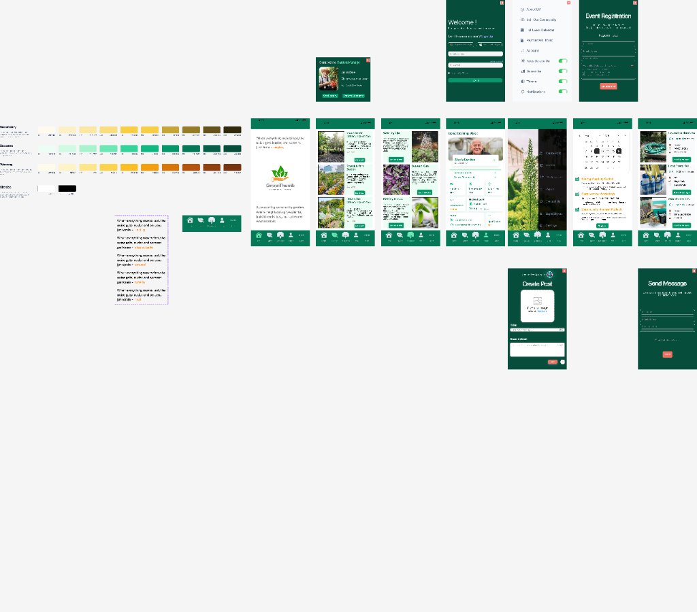

---

## 📱 Core Screen Flows & Interaction Modules

### 🌟 Flow 1: Onboarding, Community Plots, Guides & Live Telemetry

| 01. Onboarding & Philosophy | 02. Explore Garden Plots | 03. Gardening Resources | 04. Profile & Telemetry | 05. Quick Action Drawer |
| :---: | :---: | :---: | :---: | :---: |
| 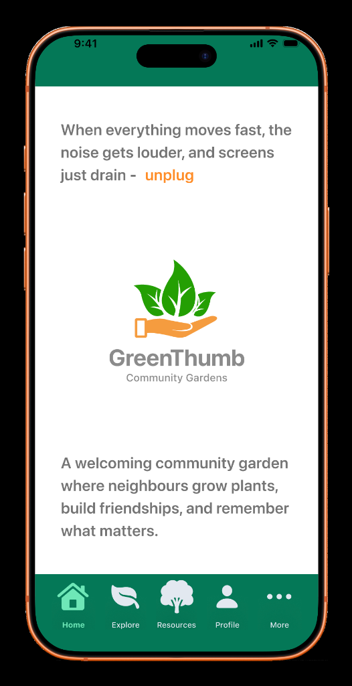 | 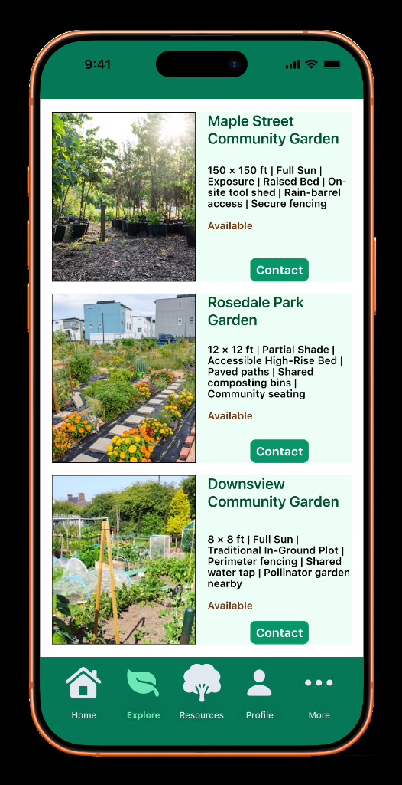 | 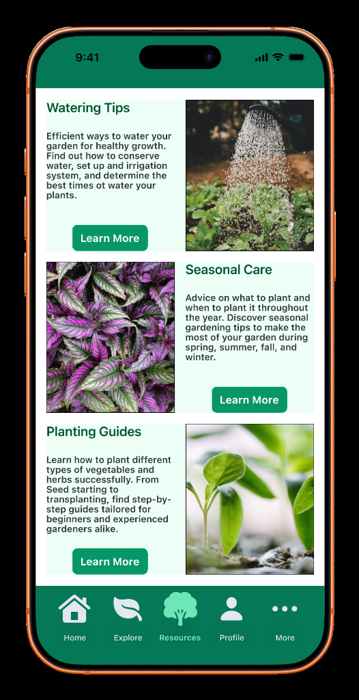 | 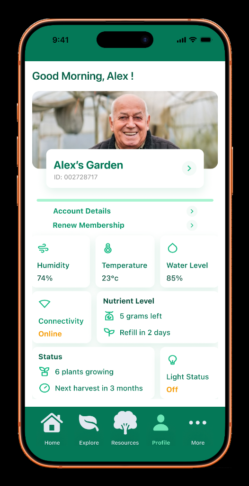 | 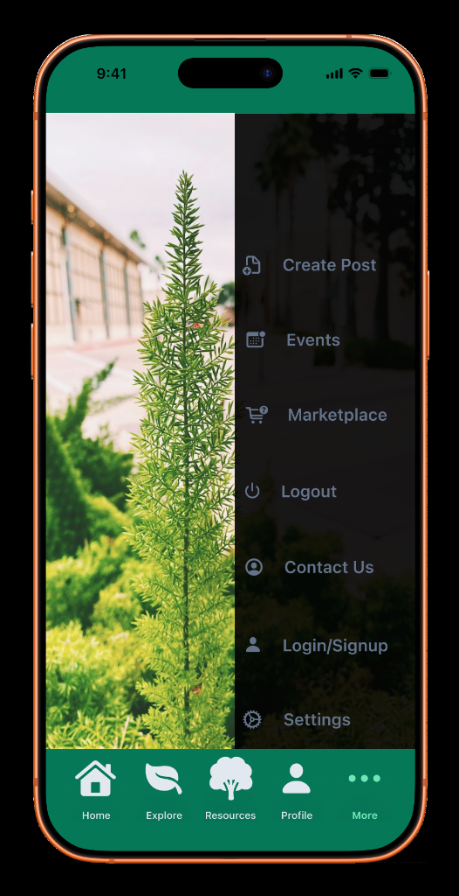 |
| **Brand Positioning**<br/>Mission-driven onboarding, mindfulness values & single-tap entry. | **Plot Directory**<br/>Plot dimensions, sun exposure, raised beds & contact actions. | **Knowledge Hub**<br/>Watering techniques, seasonal care & planting guides. | **Live IoT Telemetry**<br/>Humidity, temp, water level, nutrients & light status. | **Navigation Drawer**<br/>Glassmorphism quick hub over botanical background. |

---

### 🌟 Flow 2: Settings, Community Posts, Events, Management & Marketplace

| 06. App Preferences | 07. Community Discussions | 08. Events & Workshops | 09. Manager Communication | 10. Community Marketplace |
| :---: | :---: | :---: | :---: | :---: |
| 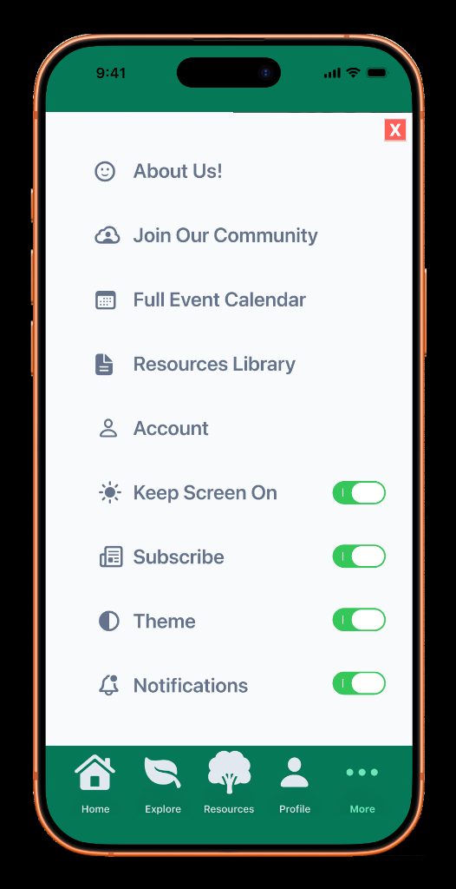 | 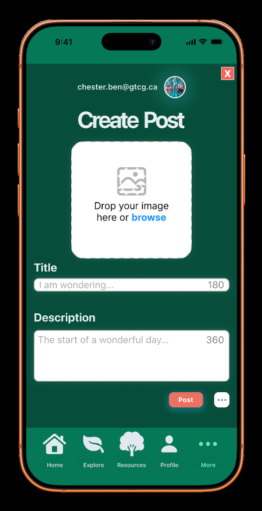 | 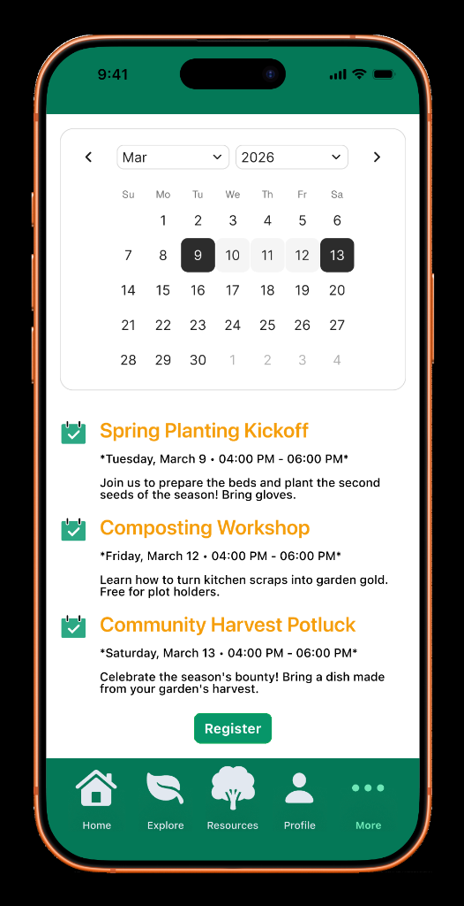 | 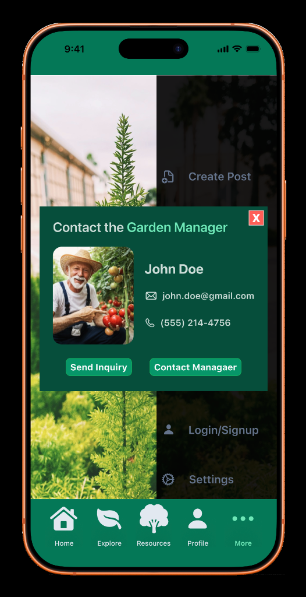 | 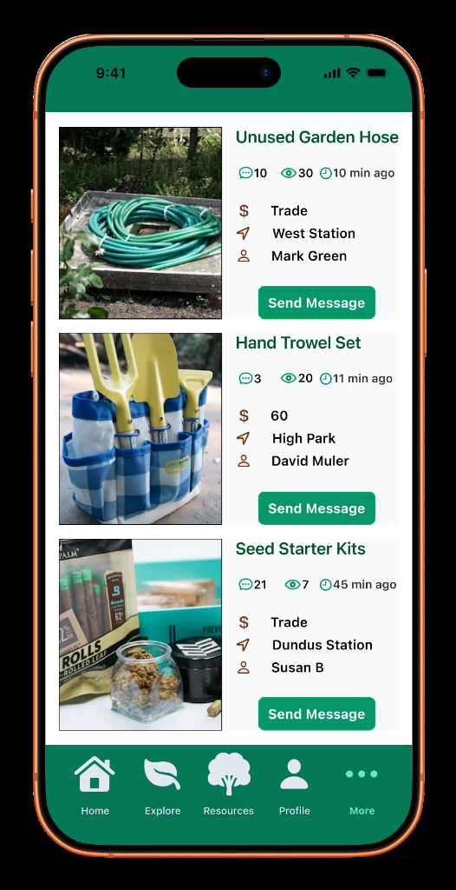 |
| **User Controls**<br/>Screen stay-on, subscriptions, themes & notification toggles. | **Post Creator**<br/>Drag-and-drop media upload & rich discussion board. | **Workshop Booking**<br/>Interactive calendar, masterclasses & one-tap RSVP. | **Direct Inquiries**<br/>Coordinator profile, verified contact & inquiry routing. | **P2P Marketplace**<br/>Tools, seed starter kits, hoses, pricing & messaging. |

---

## 🔬 In-Depth Product & Interaction Design Analysis

### 1. Mindful Onboarding & Brand Values
- **Screen 01 — Onboarding (`mobile-01-onboarding.png`):** Establishes an emotional connection with the user, emphasizing digital detox and green living: *"Where neighbours grow plants, build friendships, and remember what matters."* Provides friction-free single-tap entry with persistent bottom navigation.

### 2. Real-Time IoT Telemetry & Environmental Intelligence

<div align="center">
  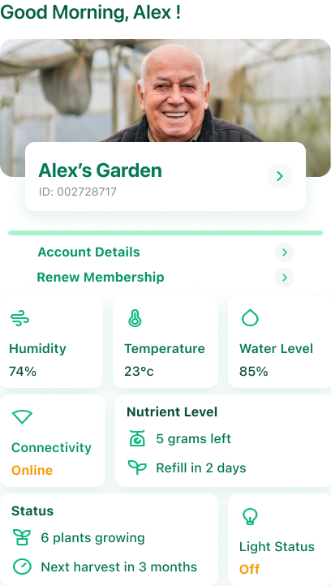
</div>

- **Screen 04 — IoT Telemetry Dashboard (`mobile-04-profile-telemetry.png` & `mobile-telemetry-dashboard-closeup.png`):**
  - **Live Sensor Metrics:** Real-time data chips for Ambient Humidity (`74%`), Temperature (`23°C`), and Reservoir Water Level (`85%`).
  - **Nutrient Automation:** Dynamic depletion monitor (`5 grams left / Refill in 2 days`).
  - **Crop Lifecycle Telemetry:** Active growth counter (`6 plants growing`) with predictive harvest schedule (`Next harvest in 3 months`).
  - **Hardware Sync:** Live online connectivity beacon and smart grow-light toggle status.

### 3. Community Garden Plot Directory & Management
- **Screen 02 — Explore Plots (`mobile-02-explore-gardens.png`):** High-density layout displaying plot dimensions (*150×150 ft, 12×12 ft*), sun exposure (*Full Sun, Partial Shade*), bed construction (*Raised Bed, Traditional In-Ground*), and live availability badges with direct manager contact routing.
- **Screen 09 — Garden Manager Modal (`mobile-09-contact-manager.png`):** Dedicated coordinator contact card with verified email, direct phone line, and structured inquiry forms.

### 4. Educational Resources & Community Marketplace
- **Screen 03 — Knowledge Base (`mobile-03-gardening-resources.png`):** Modular educational cards covering efficient watering practices, seasonal calendar tasks, and curated planting guides.
- **Screen 07 — Create Community Post (`mobile-07-create-post.png`):** Lightweight discussion composer with image drag-and-drop zone and character counter.
- **Screen 08 — Events Calendar (`mobile-08-events-calendar.png`):** Interactive monthly calendar featuring community workshops (Spring Planting Kickoff, Composting Workshops, Harvest Potlucks).
- **Screen 10 — P2P Marketplace (`mobile-10-marketplace.png`):** Circular economy hub for trading unused garden hoses, hand trowels, seed starter kits, and organic compost.

---

## 🎨 Design System & Visual Architecture

A cohesive design token system was built from the ground up to evoke botanical vitality while maintaining strict accessibility standards (WCAG 2.1 AAA).

```
┌────────────────────────────────────────────────────────────────────────────────────────┐
│                              COLOR PALETTE & DESIGN TOKENS                             │
├────────────────────────────────────────────────────────────────────────────────────────┤
│  🌲 Deep Emerald   │ #144D37 │ Primary brand identity, navigation headers, solid CTAs  │
│  🌿 Forest Leaf    │ #2C8B59 │ Secondary actions, active tab states, progress meters  │
│  🌱 Sage Mint      │ #85C19C │ Accent highlights, success indicators, subtle pill tags│
│  🪴 Terracotta     │ #E76F51 │ Attention alerts, urgent care tasks, seasonal badges   │
│  🌾 Golden Sand    │ #F4A261 │ Sunlight metrics, reward tier badges, secondary accents│
│  🌑 Slate Dark     │ #1B2E26 │ High-contrast body typography, dark elevation surfaces │
│  ☁️ Cloud Canvas    │ #F7F9F7 │ Neutral background canvas with soft botanical tint     │
└────────────────────────────────────────────────────────────────────────────────────────┘
```

### Key UI/UX Principles:
- **WCAG 2.1 AAA Accessibility:** Strict accessible contrast ratios across all typography and interactive surfaces.
- **Ergonomic Thumb-Zone Navigation:** Primary touch targets remain within single-handed thumb reach on standard mobile viewports.
- **Progressive Disclosure:** High-density sensor data and botanical taxonomy are structured into scannable cards with expandable details.

---

## 📐 End-to-End Product Design Lifecycle

The product followed a structured, human-centered product lifecycle from problem definition to final high-fidelity implementation.

```
┌───────────────────────────┐      ┌───────────────────────────┐      ┌───────────────────────────┐      ┌───────────────────────────┐
│          PHASE 1          │ ───► │          PHASE 2          │ ───► │          PHASE 3          │ ───► │          PHASE 4          │
│ UX Research & Strategy    │      │ Information Architecture  │      │ Multi-Device Web Platform │      │ Flagship Mobile Prototype │
└───────────────────────────┘      └───────────────────────────┘      └───────────────────────────┘      └───────────────────────────┘
```

| Phase | Milestone | Scope & Deliverables |
| :---: | :--- | :--- |
| **01** | **User Research & Strategy** | User interviews, persona development, journey mapping, and problem validation. |
| **02** | **Information Architecture** | Structural wireframes, layout grids, navigation hierarchies, and user flow mapping. |
| **03** | **Responsive Web Platform** | High-fidelity desktop & tablet web portal for communal plot administration and marketplace commerce. |
| **04** | **Flagship Mobile Experience** | Production-grade mobile interactive prototype, complete design system tokens, and micro-interactions. |

---

## 📂 Repository Structure

```
greenthumb-uiux-prototype/
├── design/
│   ├── AppPrototype_UIUX_Sheikh_.fig     # ★ Flagship Mobile Prototype & Design System
│   ├── Prototype__UIUX_SheikhNaim.fig    # Responsive Web Platform Prototype
│   ├── SheikhNaim_UI_UX_.fig             # Wireframes & Layout Grid Architecture
│   └── SheikhNaim-.docx                  # UX Research Brief & Strategic Journey Maps
├── screenshots/                                     # ★ Production Mobile Prototype Suite
│   ├── figma-canvas-design-system-overview.png      # Complete Figma Workspace & Design System
│   ├── mobile-telemetry-dashboard-closeup.png       # Live IoT Sensor Dashboard Widget
│   ├── mobile-01-onboarding.png                     # 01. Onboarding & Brand Philosophy
│   ├── mobile-02-explore-gardens.png                # 02. Community Garden Plots Directory
│   ├── mobile-03-gardening-resources.png            # 03. Gardening Resources Library
│   ├── mobile-04-profile-telemetry.png              # 04. Profile & IoT Telemetry Dashboard
│   ├── mobile-05-menu-drawer.png                    # 05. Quick Action Hub Drawer
│   ├── mobile-06-settings.png                       # 06. App Preferences & Toggles
│   ├── mobile-07-create-post.png                    # 07. Create Community Post Form
│   ├── mobile-08-events-calendar.png                # 08. Events & Workshop Calendar
│   ├── mobile-09-contact-manager.png                # 09. Garden Manager Contact Modal
│   └── mobile-10-marketplace.png                    # 10. Community Marketplace & Tools
├── .gitignore
├── LICENSE                                          # MIT License (Sheikh Naim)
└── README.md                                        # Executive Case Study & Documentation
```

---

## 🚀 How to Experience the Interactive Prototype in Figma

### 1. Launch Interactive Prototype in Browser:
Experience the complete interactive prototype with screen transitions, smart animations, and component flows:
👉 [**Launch GreenThumb Live Interactive Prototype**](https://www.figma.com/proto/7nucLqgY1E8BgaqP8KAQKA/AppPrototype_UIUX_Sheikh_?node-id=7-1388&p=f&t=HIqKhgHtpnOWBKuI-1&scaling=scale-down&content-scaling=fixed&page-id=7%3A1439&starting-point-node-id=195%3A3757)

👉 [**Inspect Design File & Canvas on Figma**](https://www.figma.com/design/7nucLqgY1E8BgaqP8KAQKA/AppPrototype_UIUX_Sheikh_)

### 2. Run Locally from Repository:
1. **Clone the repository:**
   ```bash
   git clone https://github.com/snaimio/greenthumb-uiux-prototype.git
   ```
2. **Open [Figma](https://www.figma.com/)** (Desktop application or Web browser).
3. **Import Deliverable:**
   - In Figma, click **Import** and select [`design/AppPrototype_UIUX_Sheikh_.fig`](./design/AppPrototype_UIUX_Sheikh_.fig).
4. **Experience Prototype Mode:**
   - Click the **Present / Play** icon in the top right (or press `Cmd + Option + Enter` on macOS / `Ctrl + Alt + Enter` on Windows) to test interactive screen transitions, smart animations, and component states.

---

## 👨‍💻 Designer Profile & Contact

**Sheikh Naim**  
*Lead Product Designer • UI/UX Specialist*

- **GitHub:** [@snaimio](https://github.com/snaimio)  
- **Live Interactive Prototype:** [GreenThumb on Figma](https://www.figma.com/proto/7nucLqgY1E8BgaqP8KAQKA/AppPrototype_UIUX_Sheikh_?node-id=7-1388&p=f&t=HIqKhgHtpnOWBKuI-1&scaling=scale-down&content-scaling=fixed&page-id=7%3A1439&starting-point-node-id=195%3A3757)  
- **Design System Canvas:** [Figma Design File](https://www.figma.com/design/7nucLqgY1E8BgaqP8KAQKA/AppPrototype_UIUX_Sheikh_)

---

<div align="center">
  <sub>Crafted with passion for sustainable urban communities • GreenThumb Design System</sub>
</div>
