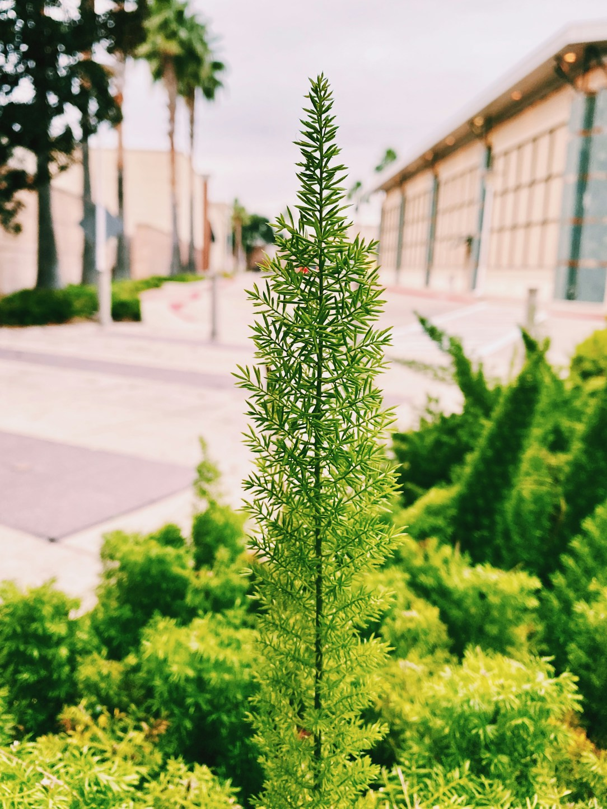
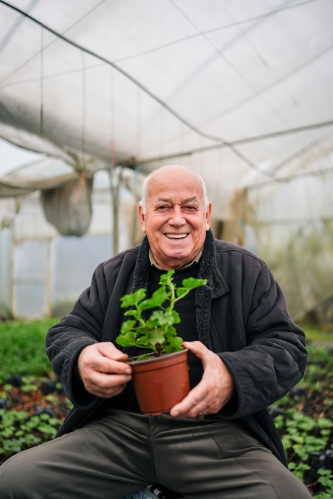

<div align="center">

# 🌱 GreenThumb — Mobile App UI/UX & Design System
### **Human-Centered Product Design Case Study & Interactive Prototype**

[](https://www.figma.com/design/7nuclqgy1E88gaqP8KAQKA/AppPrototype_UIUX_Sheikh_Assignment4)
[](./design)
[](./screenshots)
[](./LICENSE)

<br/>

**Designed & Architected by Sheikh Naim**  
*Product Design • User Research • Design Systems • Interactive Prototyping*

[**🚀 Launch Interactive Figma Prototype**](https://www.figma.com/design/7nuclqgy1E88gaqP8KAQKA/AppPrototype_UIUX_Sheikh_Assignment4) • [**📱 View Final Mobile App Screens**](#-final-capstone-showcase-mobile-application-prototype-assignment-4) • [**📐 View Design Evolution**](#-end-to-end-design-evolution-from-low-fi-to-final-prototype) • [**🎨 Design System Tokens**](#-design-system--visual-architecture)

</div>

---

## 📌 Executive Summary

**GreenThumb** is an end-to-end digital gardening ecosystem designed to bridge the gap between novice urban plant enthusiasts, seasoned horticulturists, and neighborhood community gardens.

Urban gardeners face recurring friction points: inconsistent watering routines, difficulty diagnosing plant ailments, fragmented knowledge sources, and limited visibility into local communal gardening plots. GreenThumb solves this through a unified product architecture featuring **smart plant telemetry tracking, neighborhood garden plot management, an integrated plant & supply marketplace, and workshop event coordination.**

```
┌────────────────────────────────────────────────────────────────────────────────────────┐
│                                 PRODUCT SPECIFICATIONS                                 │
├───────────────────┬────────────────────────────────────────────────────────────────────┤
│ 🎯 Designer       │ Sheikh Naim (Lead UI/UX & Product Design)                          │
│ 🛠 Tools          │ Figma, Microsoft Whiteboard, User Journey Mapping, Design Systems  │
│ 📱 Core Platform  │ Native Mobile App (iOS / Android) & Responsive Web Portal          │
│ 🔗 Figma Key      │ 7nuclqgy1E88gaqP8KAQKA                                             │
│ 🚀 Deliverables   │ Mobile Prototype (.fig), Web Prototype (.fig), Design Specs        │
└───────────────────┴────────────────────────────────────────────────────────────────────┘
```

---

## 📱 Final Capstone Showcase: Mobile Application Prototype (Assignment 4)

> [!IMPORTANT]
> **Assignment 4 is the definitive, production-ready capstone deliverable.** It synthesizes findings from earlier wireframing and web iterations into an ergonomic, high-fidelity mobile application experience crafted in Figma.

### Complete Mobile Canvas & Prototype Ecosystem


---

### 🌟 Deep-Dive: Core Mobile Screens & Feature Modules

| Interface & Screen Component | Visual Deliverable | UX Architecture & Feature Breakdown |
| :--- | :---: | :--- |
| **Home Garden Feed & Community Hero** |  | • **Personalized Garden Workspace:** Real-time summary of saved plants and upcoming care alerts.<br/>• **Community Spotlights:** Local neighborhood garden announcements and seasonal planting recommendations. |
| **Smart Plant Care & Telemetry Tracker** |  | • **Telemetry Indicators:** Visual moisture levels, sunlight requirements, and ambient temperature thresholds.<br/>• **Automated Reminders:** Smart countdowns to next watering, pruning, and fertilizing cycles. |
| **Botanical Specimen & Care Profile** |  | • **Deep-Dive Taxonomy:** Botanical classification, light tolerances, toxicity warnings for pets, and propagation guides.<br/>• **Health Diagnostic Journal:** Visual photo log to monitor leaf growth and detect pest anomalies. |
| **Specimen Quick-Card & Care Summary** |  | • **Scannable UI Card:** High-contrast care difficulty rating, hydration index, and one-tap "Care Complete" log action.<br/>• **Adaptive Status Indicators:** Color-coded badges for immediate status identification. |
| **Care Metrics & Environment Telemetry** |  | • **Modular Widget System:** High-density stat chips detailing soil moisture %, Lux sunlight intensity, and humidity levels.<br/>• **Data-Driven Diagnostics:** Predictive alerts before soil reaches critical dehydration. |
| **Community Plots & Grower Network** |  | • **Urban Garden Allocation:** Interactive plot booking (*e.g., Plot 12 North Section*) with shared tool locker access.<br/>• **Local Grower Profiles:** Connect with neighborhood plot neighbors and organize volunteer work sessions. |
| **Community Member Badges & Plot Cards** | &nbsp;&nbsp; | • **Gamified Badges:** Earn volunteer milestone credentials and seed-sharing reputation scores.<br/>• **Plot Snapshot Cards:** Compact cards displaying sunlight exposure, plot dimensions, and harvest timelines. |

---

## 🎨 Design System & Visual Architecture

A comprehensive design token architecture was developed in Figma to deliver botanical vibrancy while strictly adhering to WCAG 2.1 AAA accessibility standards.

```
┌────────────────────────────────────────────────────────────────────────────────────────┐
│                              COLOR PALETTE & DESIGN TOKENS                             │
├────────────────────────────────────────────────────────────────────────────────────────┤
│  🌲 Deep Emerald   │ #144D37 │ Primary brand identity, navigation headers, solid CTAs  │
│  🌿 Forest Leaf    │ #2C8B59 │ Secondary actions, active tab states, progress meters  │
│  🌱 Sage Mint      │ #85C19C │ Accent highlights, success indicators, subtle pill tags│
│  🪴 Terracotta     │ #E76F51 │ Attention alerts, urgent care tasks, seasonal badges   │
│  🌾 Golden Sand    │ #F4A261 │ Sunlight metrics, reward tier badges, secondary accents│
│  🌑 Slate Dark     │ #1B2E26 │ High-contrast body typography, dark elevation surfaces │
│  ☁️ Cloud Canvas    │ #F7F9F7 │ Neutral background canvas with soft botanical tint     │
└────────────────────────────────────────────────────────────────────────────────────────┘
```

### Key UI/UX Principles:
- **WCAG 2.1 AAA Contrast:** Every typography token and interactive element meets strict accessible contrast ratios.
- **Ergonomic Thumb-Zone Navigation:** All primary actions (logging care, scanning plants, exploring plots) remain within single-handed thumb reach on mobile viewports.
- **Progressive Disclosure:** High-density plant taxonomy and telemetry are structured into glanceable, modular cards with expandable deep-dive sheets.

---

## 💻 Responsive Web Platform Prototype (Phase 3)

The high-fidelity web application companion extends the ecosystem for large-format displays, community plot administration, and botanical commerce.

| Web Interface Module | Screen Capture | Product Functionality |
| :--- | :---: | :--- |
| **Discovery & Landing Portal** |  | Dynamic search, curated botanical spotlights, seasonal planting advisories, and quick category filters. |
| **Community Gardens Network** |  | Local garden locator, interactive plot availability maps, and community volunteer team rosters. |
| **Plant Care Encyclopedia** |  | Botanical knowledge base filterable by sunlight intensity, soil type, hardiness zone, and indoor/outdoor suitability. |
| **Marketplace & Local Nurseries** |  | Direct-to-consumer plant commerce with verified local nursery listings, seed kits, organic compost, and user reviews. |
| **Events & Masterclass Calendar** |  | Community workshop schedules (pruning, potting, soil testing), RSVP coordination, and reminder syncing. |

---

## 📐 End-to-End Design Evolution: From Low-Fi to Final Prototype

The project followed the **Double Diamond design methodology**, evolving across four structured phases from initial user research and whiteboard wireframes to the final polished mobile application.

```
┌───────────────────────────┐      ┌───────────────────────────┐      ┌───────────────────────────┐      ┌───────────────────────────┐
│     PHASE 1 (Low-Fi)      │ ───► │     PHASE 2 (Mid-Fi)      │ ───► │     PHASE 3 (Web HiFi)    │ ───► │   PHASE 4 (FINAL CAPSTONE)│
│  UX Research & Whiteboard │      │   Architecture & Layouts  │      │  Responsive Web Platform  │      │  Interactive Mobile App   │
└───────────────────────────┘      └───────────────────────────┘      └───────────────────────────┘      └───────────────────────────┘
```

### Phase 1: Low-Fidelity Whiteboard Ideation & Architecture


<details>
<summary><b>🔍 Click to expand individual Phase 1 low-fidelity wireframe screens</b></summary>
<br/>

| Low-Fi Module | Screen Capture | Strategic Purpose |
| :--- | :---: | :--- |
| **Home / Plot Listings** |  | Validating information hierarchy for search filters, plot dimensions, and map placement. |
| **Events Calendar** |  | Structuring monthly calendar interactions and direct registration CTA triggers. |
| **Gardening Resources** |  | Testing card grids for pest management guides, seasonal calendars, and soil articles. |
| **Community Marketplace** |  | Wireframing peer-to-peer produce exchange, tool sharing, and seed swap listings. |
| **Members Dashboard** |  | Designing member portal metrics: active plot ID, logged volunteer hours, and maintenance tickets. |
| **Plot Details & Log** |  | Defining layout for plot specifications (sunlight/water availability) and photo journals. |

</details>

---

## 📊 Milestone & Deliverables Matrix

| Phase | Deliverable File | Core Scope & Impact |
| :---: | :--- | :--- |
| **Phase 4 (FINAL)** | [**`design/AppPrototype_UIUX_Sheikh_Assignment4.fig`**](design/AppPrototype_UIUX_Sheikh_Assignment4.fig) | **★ Final Mobile App Prototype, Interactive Flows & Design System Tokens ★** |
| **Phase 3** | [`design/Prototype_Assignment3_UIUX_SheikhNaim.fig`](design/Prototype_Assignment3_UIUX_SheikhNaim.fig) | High-Fidelity Web Prototype, Community Modules, Marketplace & Event Workflows |
| **Phase 2** | [`design/SheikhNaim_UI_UX_Assignment2.fig`](design/SheikhNaim_UI_UX_Assignment2.fig) | Responsive Web Architecture, Grid System & Desktop Wireframe Layouts |
| **Phase 1** | [`design/SheikhNaim-Assignment1.docx`](design/SheikhNaim-Assignment1.docx) | UX Research Document, Personas, Problem Statement & Whiteboard Wireframes |

---

## 📂 Repository File Structure

```
greenthumb-uiux-prototype/
├── design/
│   ├── AppPrototype_UIUX_Sheikh_Assignment4.fig  # ★ FINAL CAPSTONE: Mobile Prototype & Design System
│   ├── Prototype_Assignment3_UIUX_SheikhNaim.fig # Phase 3: High-Fidelity Web Prototype
│   ├── SheikhNaim_UI_UX_Assignment2.fig          # Phase 2: Responsive Web Architecture
│   └── SheikhNaim-Assignment1.docx               # Phase 1: User Research Brief & Low-Fi Wireframes
├── screenshots/
│   ├── mobile-app-prototype-overview.png         # Final Mobile Prototype Canvas
│   ├── mobile-hero-garden-banner.png             # Mobile Home Feed & Hero Banner
│   ├── plant-care-banner.png                     # Mobile Plant Care & Telemetry Tracker
│   ├── mobile-plant-profile-detail.png           # Mobile Specimen Profile Screen
│   ├── mobile-plant-card-view.png                # Mobile Plant Card Quick-View
│   ├── mobile-care-stats-widget.png              # Mobile Care Metrics Telemetry Widget
│   ├── mobile-garden-badge.png                   # Mobile Garden Milestone Badge
│   ├── mobile-community-card.png                 # Mobile Community Member Card
│   ├── mobile-plot-thumbnail.png                 # Mobile Community Plot Card
│   ├── community-plot-banner.png                 # Community Garden Showcase Banner
│   ├── web-landing-hero.png                      # Web Discovery Landing Hero
│   ├── web-community-gardens.png                 # Web Community Garden Network
│   ├── web-plant-care-guide.png                  # Web Plant Care Encyclopedia
│   ├── web-marketplace-plants.png                # Web Marketplace Catalog
│   ├── web-events-calendar.png                   # Web Workshop & Event Calendar
│   ├── web-prototype-overview.png                # Web Prototype Canvas
│   ├── web-wireframes-overview.png               # Wireframes Canvas
│   ├── lowfi-wireframes-whiteboard-overview.png  # Whiteboard Low-Fi Wireframes Canvas
│   ├── lowfi-home-plot-listings.png              # Low-Fi Plot Listings
│   ├── lowfi-events-calendar.png                 # Low-Fi Events Calendar
│   ├── lowfi-gardening-resources.png             # Low-Fi Resources
│   ├── lowfi-community-marketplace.png           # Low-Fi Marketplace
│   ├── lowfi-members-dashboard.png               # Low-Fi Dashboard
│   └── lowfi-plot-details.png                    # Low-Fi Plot Details
├── .gitignore
├── LICENSE                                       # MIT License (Sheikh Naim)
└── README.md                                     # Comprehensive Case Study & Documentation
```

---

## 🚀 How to Run the Interactive Prototypes in Figma

### 1. View Direct in Figma Web:
Access the shared interactive prototype directly:
👉 [**Open GreenThumb Prototype on Figma**](https://www.figma.com/design/7nuclqgy1E88gaqP8KAQKA/AppPrototype_UIUX_Sheikh_Assignment4)

### 2. Run Locally from Repository:
1. **Clone the repository:**
   ```bash
   git clone https://github.com/snaimio/greenthumb-uiux-prototype.git
   ```
2. **Open [Figma](https://www.figma.com/)** (Desktop application or Web browser).
3. **Import the Final Deliverable:**
   - In Figma, click **Import** and select [`design/AppPrototype_UIUX_Sheikh_Assignment4.fig`](./design/AppPrototype_UIUX_Sheikh_Assignment4.fig).
4. **Experience Prototype Mode:**
   - Click the **Present / Play** icon in the top right (or press `Cmd + Option + Enter` on macOS / `Ctrl + Alt + Enter` on Windows) to test interactive screen transitions, smart animations, and component states.

---

## 👨‍💻 Designer Profile & Contact

**Sheikh Naim**  
*Product Designer • UI/UX Specialist*

- **GitHub:** [@snaimio](https://github.com/snaimio)  
- **Figma Prototype:** [GreenThumb on Figma](https://www.figma.com/design/7nuclqgy1E88gaqP8KAQKA/AppPrototype_UIUX_Sheikh_Assignment4)

---

<div align="center">
  <sub>Crafted with passion for sustainable urban communities • GreenThumb Design System</sub>
</div>
