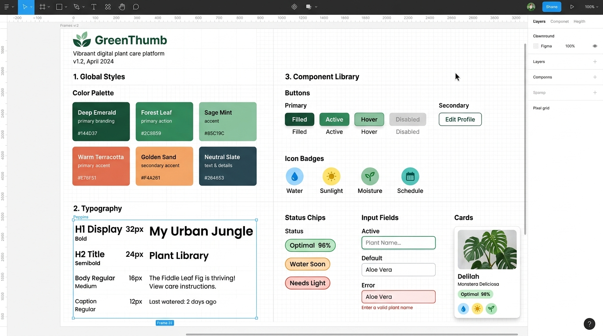
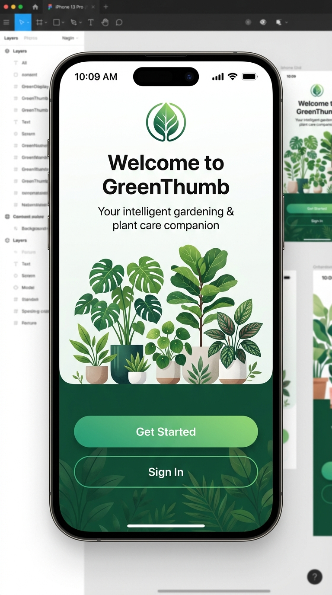
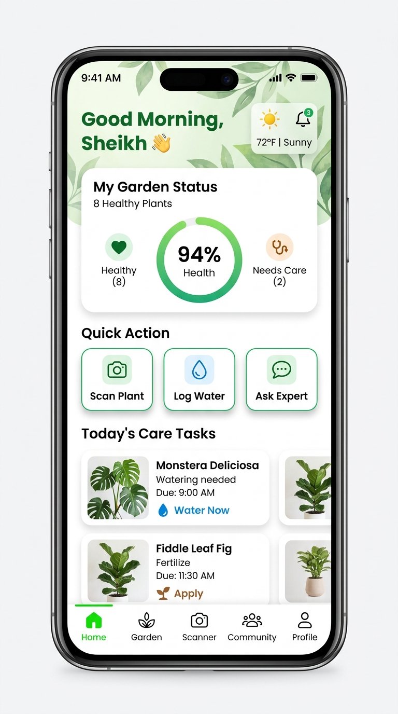
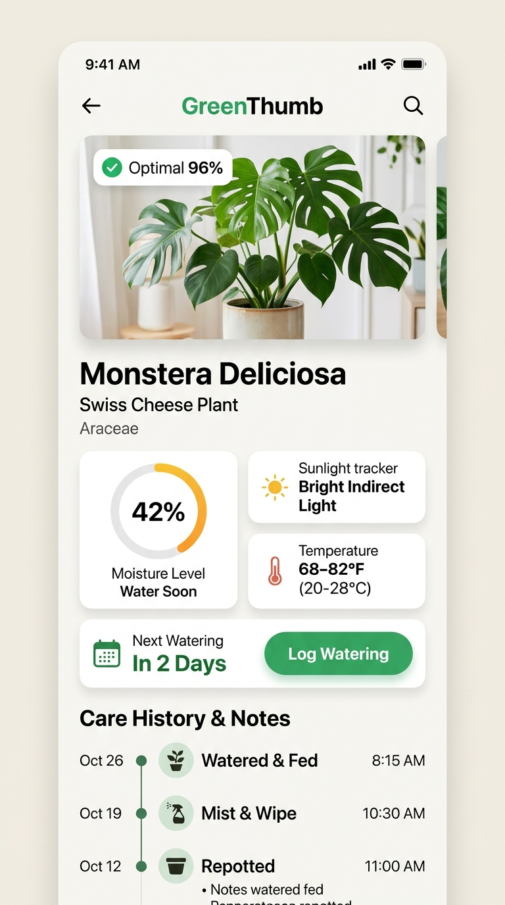
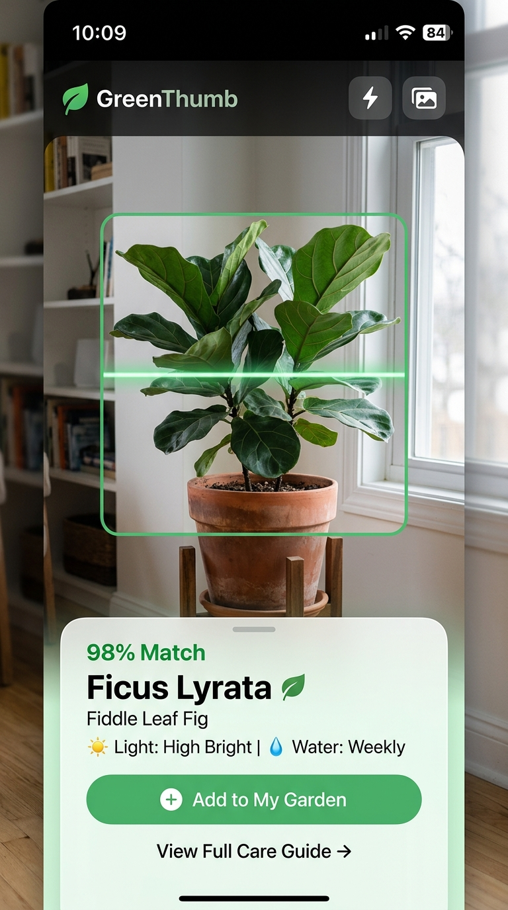
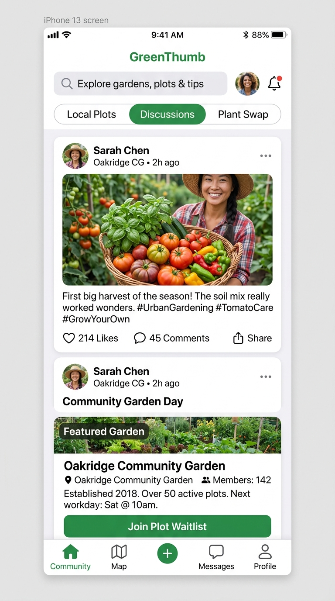
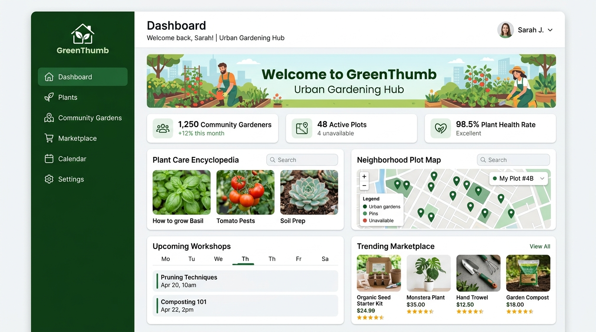
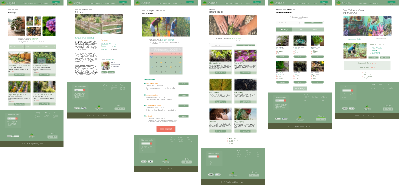
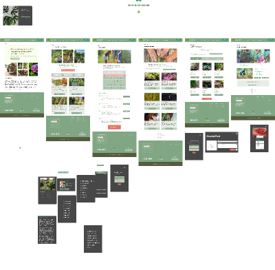

# 🌱 GreenThumb — UI/UX Design System & Interactive Prototype

[](https://www.figma.com)
[-2ea44f?style=for-the-badge)](./design)
[](./screenshots)
[](./LICENSE)

**GreenThumb** is a comprehensive, human-centered digital gardening platform and companion application engineered to empower urban gardeners, houseplant enthusiasts, and community growers. From intelligent plant diagnosis and real-time care schedules to neighborhood plot reservations and nursery marketplaces, GreenThumb connects botanical knowledge with intuitive interface design.

---

## 🎨 Design System & Component Architecture

The visual architecture is anchored in organic, earthy tones balanced with crisp typography and modern accessibility standards (WCAG AAA).



### Color Palette & Design Tokens
* **Primary Brand:** Deep Emerald (`#144D37`), Forest Leaf (`#2C8B59`), Sage Mint (`#85C19C`)
* **Warm Accents:** Terracotta (`#E76F51`), Golden Sand (`#F4A261`), Neutral Slate (`#264653`)
* **Typography Hierarchy:** Poppins / Inter scale ranging from Display H1 (`32px/Bold`) down to Caption (`12px/Regular`).
* **Micro-Components:** Rounded status chips (`Optimal 96%`, `Water Soon`, `Needs Light`), moisture telemetry rings, and interactive bottom navigation.

---

## 📱 Mobile App Experience & Screen Flows

A native iOS/Android experience crafted with ergonomic thumb-zone navigation, clean card hierarchies, and augmented reality interactions.

| 1. Onboarding & Welcome | 2. Home Dashboard & Health | 3. Plant Profile & Care Guide |
| :---: | :---: | :---: |
|  |  |  |
| *Personalized onboarding & botanical introduction.* | *Live garden health index, weather sync & daily task feed.* | *Real-time moisture gauge, sunlight tracker & care log.* |

<br/>

| 4. AR / AI Plant Identification | 5. Community Gardens & Feed | 6. Plant Care Tracker Banner |
| :---: | :---: | :---: |
|  |  |  |
| *Camera viewfinder with instant 98% species recognition.* | *Local urban plot waitlists, harvest posts & discussions.* | *Modular telemetry card for hydration & nutrients.* |

---

## 💻 Web Platform & Responsive Desktop Portal

A data-rich responsive desktop dashboard connecting users to neighborhood gardening networks, marketplace supplies, and masterclass schedules.

### Desktop Hub & Operational Dashboard


### Web Modules Breakdown

| Interface Module | High-Resolution Capture | UX Capabilities & Features |
| :--- | :---: | :--- |
| **Landing & Discovery Portal** |  | Hero showcase with smart search, seasonal care tips, and curated botanical collections. |
| **Plant Care Encyclopedia** |  | Comprehensive directory filterable by sunlight, indoor/outdoor suitability, and soil type. |
| **Community Gardens Network** |  | Neighborhood garden map, plot reservation management, and volunteer coordination. |
| **Marketplace & Local Nurseries** |  | Direct-to-grower plant shop, organic fertilizers, seed kits, and verified seller ratings. |
| **Events & Workshop Calendar** |  | Community planting workshops, pruning masterclasses, and RSVP schedules. |

---

## 🔄 Project Evolution & Deliverables

```
┌─────────────────────────────────┐      ┌─────────────────────────────────┐      ┌─────────────────────────────────┐
│   Phase 1: Low-Fi Wireframes    │ ───► │  Phase 2: Hi-Fi Web Prototype   │ ───► │ Phase 3: Mobile Native System   │
│   (SheikhNaim_Assignment2)      │      │  (Prototype_Assignment3)        │      │ (AppPrototype_Assignment4)      │
└─────────────────────────────────┘      └─────────────────────────────────┘      └─────────────────────────────────┘
```

| Milestone | Deliverable File | Focus Areas | Visual Board |
| :--- | :--- | :--- | :---: |
| **Phase 1: Wireframes & Architecture** | [`SheikhNaim_UI_UX_Assignment2.fig`](design/SheikhNaim_UI_UX_Assignment2.fig) | Information architecture, user flows, responsive grid systems. |  |
| **Phase 2: Interactive Web Prototype** | [`Prototype_Assignment3_UIUX_SheikhNaim.fig`](design/Prototype_Assignment3_UIUX_SheikhNaim.fig) | Full interactive web application, e-commerce flow, events calendar. |  |
| **Phase 3: Mobile App & Design System** | [`AppPrototype_UIUX_Sheikh_Assignment4.fig`](design/AppPrototype_UIUX_Sheikh_Assignment4.fig) | Native iOS/Android design tokens, AR camera scanner, micro-interactions. |  |

---

## 📂 Repository Structure

```
greenthumb-uiux-prototype/
├── design/
│   ├── AppPrototype_UIUX_Sheikh_Assignment4.fig     # Mobile App Prototype & Design System
│   ├── Prototype_Assignment3_UIUX_SheikhNaim.fig    # High-Fidelity Web Prototype & Flows
│   └── SheikhNaim_UI_UX_Assignment2.fig             # Responsive Web Wireframes & Architecture
├── screenshots/
│   ├── design_system_tokens.jpg                     # High-res design tokens & component library
│   ├── mobile_onboarding.jpg                        # High-res mobile onboarding & welcome screen
│   ├── mobile_dashboard.jpg                         # High-res mobile home dashboard & care feed
│   ├── mobile_plant_detail.jpg                      # High-res plant profile & moisture gauge
│   ├── mobile_ar_scanner.jpg                        # High-res AR plant camera viewfinder
│   ├── mobile_community.jpg                         # High-res community garden feed & plot waitlists
│   ├── web_desktop_dashboard.jpg                    # High-res desktop web application hub
│   ├── web-landing-hero.png                         # High-res web discovery landing
│   ├── web-plant-care-guide.png                     # High-res plant care encyclopedia
│   ├── web-community-gardens.png                    # High-res community garden network
│   ├── web-marketplace-plants.png                   # High-res marketplace catalog
│   ├── web-events-calendar.png                      # High-res workshop & event calendar
│   ├── plant-care-banner.png                        # Mobile telemetry card
│   ├── mobile-app-prototype-overview.png            # Board thumbnail preview
│   ├── web-prototype-overview.png                   # Board thumbnail preview
│   └── web-wireframes-overview.png                  # Board thumbnail preview
├── .gitignore
├── LICENSE
└── README.md
```

---

## 🚀 How to View and Run the Figma Prototypes

1. **Clone the repository:**
   ```bash
   git clone https://github.com/snaimio/greenthumb-uiux-prototype.git
   ```
2. **Open [Figma](https://www.figma.com/)** (Desktop app or web browser).
3. **Import the files:**
   - In Figma, click **Import** or drag and drop any file from the [`design/`](./design) directory.
4. **Launch Presentation Mode:**
   - Press `Cmd + Option + Enter` (macOS) or `Ctrl + Alt + Enter` (Windows) to run interactive prototype transitions, overlays, and smart animations.

---

## 👤 Author & Designer

**Sheikh Naim (Tanjin Sufi)**  
- GitHub: [@snaimio](https://github.com/snaimio)  
- Figma Prototype: [GreenThumb on Figma](https://www.figma.com)
